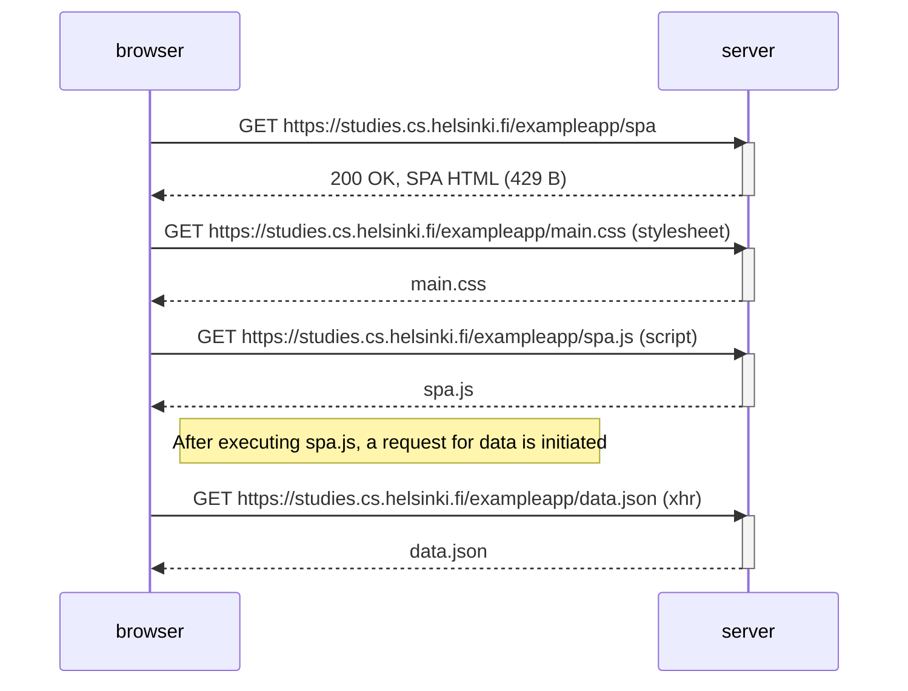

```mermaid
sequenceDiagram
    participant browser
    participant server

    browser->>server: GET https://studies.cs.helsinki.fi/exampleapp/spa 
    activate server
    server-->>browser: 200 OK, SPA HTML (429 B)
    deactivate server

    browser->>server: GET https://studies.cs.helsinki.fi/exampleapp/main.css (stylesheet)
    activate server
    server-->>browser: main.css 
    deactivate server

    browser->>server: GET https://studies.cs.helsinki.fi/exampleapp/spa.js (script)
    activate server
    server-->>browser: spa.js
    deactivate server

    Note right of browser: After executing spa.js, a request for data is initiated

    browser->>server: GET https://studies.cs.helsinki.fi/exampleapp/data.json (xhr)
    activate server
    server-->>browser: data.json 
    deactivate server
```