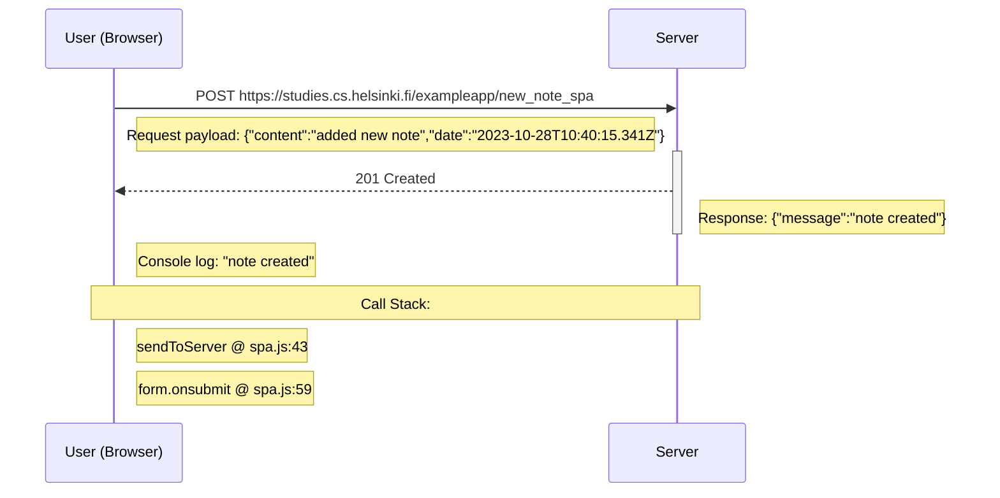

```mermaid
sequenceDiagram
    participant User as User (Browser)
    participant Server

    User->>Server: POST https://studies.cs.helsinki.fi/exampleapp/new_note_spa
    Note right of User: Request payload: {"content":"added new note","date":"2023-10-28T10:40:15.341Z"}
    activate Server

    Server-->>User: 201 Created
    Note right of Server: Response: {"message":"note created"}
    deactivate Server

    Note right of User: Console log: "note created"
    Note over User,Server: Call Stack:
    Note right of User: sendToServer @ spa.js:43
    Note right of User: form.onsubmit @ spa.js:59
```